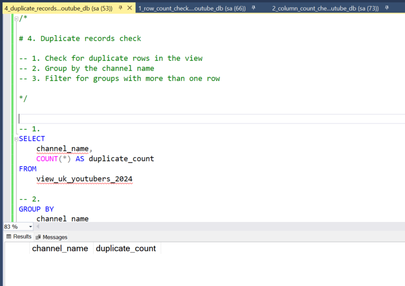

# Data Portfolio: Top 10 Excel to Power BI 


# Table of contents 

- [Objectif](#objectif)
- [Data Source](#data-source)
- [Étape](#étape)
- [Design](#design)
  - [Mockup](#mockup)
  - [Outils utilisés](#outils-utilisés)
- [Dévelopment](#dévelopment)
  - [Pseudocode](#pseudocode)
  - [Data Exploration](#data-exploration)
  - [Data Cleaning](#data-cleaning)
  - [Transform er la données](#transformer-la-données)
  - [Créer la vue SQL](#Créer-la-vue-SQL)
- [Tests](#tests)
  - [Data Quality Tests](#data-quality-tests)
- [Visualization](#visualization)
  - [Résultat](#résultat)
  - [Mesure DAX](#mesure-dax)
- [Analyse](#analyse)
  - [Résultat](#findings)
  - [Validation](#validation)
  - [Découverte](#découverte)
- [Recommendations](#recommendations)
  - [Potential ROI](#potential-roi)
  - [Mesures envisageables](#mesures-envisageables)


#  Objectif 

- Quel est le principal point faible ? 

Le responsable marketing souhaite connaître les meilleurs YouTubers en 2024 afin de déterminer lesquels seraient les plus adaptés pour mener des campagnes marketing tout au long de l'année.


- Quelle est la solution idéale ?

Créer un dashboard qui fournit des informations sur les meilleurs YouTubers britanniques en 2024, notamment :
- le nombre d'abonnés
- le nombre total de vues
- le nombre total de vidéos
- les indicateurs d'engagement

Cela aidera l'équipe marketing à prendre des décisions éclairées quant aux YouTubers avec lesquels collaborer pour ses campagnes marketing.

## User story 

En tant que responsable marketing, je souhaite utiliser un tableau de bord qui analyse les données des chaînes YouTube au Royaume-Uni . 

Ce dashboard doit me permettre d'identifier les chaînes les plus performantes en fonction de critères tels que le nombre d'abonnés et le nombre moyen de vues. 

Grâce à ces informations, je peux prendre des décisions éclairées quant aux youtubeurs avec lesquels il est judicieux de collaborer, et ainsi optimiser l'efficacité de chaque campagne marketing.


# Data source 

- Quelles données sont nécessaires pour atteindre notre objectif ?

Nous avons besoin de données sur les meilleurs YouTubers britanniques en 2024, notamment 
- le nom de leur chaîne
- le nombre total d'abonnés
- le nombre total de vues
- le nombre total de vidéos mises en ligne


- D'où proviennent les données ? 
Les données proviennent de Kaggle (fichier Excel). [Cliquez ici pour le trouver.](https://www.kaggle.com/datasets/bhavyadhingra00020/top-100-social-media-influencers-2024-countrywise?resource=download)


# Étapes

- Conception
- Développement
- Test
- Analyse
 


# Design 

## Composants requis pour le dashboard

- Que doit contenir le dashboard en fonction des exigences fournies ?

Pour comprendre ce qu'il doit contenir, nous devons déterminer les questions auxquelles le tableau de bord doit répondre :

1. Qui sont les 10 YouTubers ayant le plus d'abonnés ?
2. Quelles sont les 3 chaînes qui ont mis en ligne le plus de vidéos ?
3. Quelles sont les 3 chaînes qui ont le plus de vues ?
4. Quelles sont les 3 chaînes qui ont le plus grand nombre moyen de vues par vidéo ?
5. Quelles sont les 3 chaînes qui ont le plus grand nombre de vues par abonné ?
6. Quelles sont les 3 chaînes qui ont le plus grand taux d'engagement des abonnés par vidéo mise en ligne ?

Pour l'instant, voici quelques-unes des questions auxquelles nous devons répondre, mais cela peut changer au fur et à mesure de notre analyse.

## Dashboard mockup

À quoi cela devrait-il ressembler ? 

Voici quelques exemples de visuels de données qui pourraient convenir pour répondre à nos questions :

1. Tableau
2. Treemap
3. Scorecards
4. Graphique à barres horizontales


## Outils utilisés 


| Outil | Objectif |
| --- | --- |
| Excel | Exploration des données |
| SQL Server | Nettoyage, test et analyse des données |
| Power BI | Visualisation des données via des dashboard interactifs |
| GitHub | Hébergement de la documentation du projet et contrôle des versions |
| Mokkup AI | Conception de la maquette du dashboard |

# Dévelopment

## Pseudocode

- Quelle est l'approche générale pour créer cette solution du début à la fin ?

1. Obtenir les données
2. Explorer les données dans Excel
3. Charger les données dans SQL Server
4. Nettoyer les données avec SQL
5. Tester les données avec SQL
6. Visualiser les données dans Power BI
7. Générer les résultats à partir des informations obtenues
8. Rédiger la documentation + les commentaires
9. Publier les données sur GitHub Pages

## Data exploration notes

Il s'agit de l'étape où nous examinons le contenu des données, les erreurs, les incohérences, les bogues, les caractères étranges et corrompus, etc.


- Quelles sont nos premières observations concernant cet ensemble de données ? Qu'est-ce qui a retenu notre attention jusqu'à présent ? 

1. Au moins 4 colonnes contiennent les données dont nous avons besoin pour cette analyse, ce qui signifie que nous avons tout ce qu'il nous faut dans le fichier sans avoir à contacter le client pour obtenir davantage de données.
2. La première colonne contient l'ID des noms de chaînes avec ce qui semble être des ID de noms de chaînes, séparés par le symbole @. Nous devons en extraire les noms des chaînes.
4. Certaines cellules et certains noms d'en-tête sont dans une autre langue. Nous devons vérifier si ces colonnes sont nécessaires et, si oui, nous devons les traiter.
5. Nous avons plus de données que nécessaire, certaines de ces colonnes devront donc être supprimées.


## Data cleaning 

- À quoi doivent ressembler les données nettoyées ? (Que doivent-elles contenir ? Quelles contraintes devons-nous leur appliquer ?)

L'objectif est d'affiner notre ensemble de données afin de garantir qu'il soit structuré et prêt à être analysé. 

Les données nettoyées doivent répondre aux critères et contraintes suivants :

- Seules les colonnes pertinentes doivent être conservées.
- Tous les types de données doivent être adaptés au contenu de chaque colonne.
- Aucune colonne ne doit contenir de valeurs nulles, ce qui indique que les données sont complètes pour tous les enregistrements.

Vous trouverez ci-dessous un tableau présentant les contraintes applicables à notre ensemble de données nettoyées :

| Propriété | Description |
| --- | --- |
| Number of Rows | 100 |
| Number of Columns | 4 |

Voici une représentation sous forme de tableau du schéma attendu pour les données nettoyées :

| Nom de la colonne | Type de données | Nullable |
| --- | --- | --- |
| channel_name | VARCHAR | NO |
| total_subscribers | INTEGER | NO |
| total_views | INTEGER | NO |
| total_videos | INTEGER | NO |


- Quelles étapes sont nécessaires pour nettoyer et mettre en forme les données dans le format souhaité ?

1. Supprimez les colonnes inutiles en ne sélectionnant que celles dont vous avez besoin
2. Extrayez les noms des chaînes YouTube de la première colonne
3. Renommez les colonnes à l'aide d'alias


### Transformer la données 


```sql
/*
# 1. Sélectionnez les colonnes requises
# 2. Extrayez le nom de la chaîne à partir de la colonne 'NOMBRE'
*/

-- 1.
SELECT
    SUBSTRING(NOMBRE, 1, CHARINDEX('@', NOMBRE) -1) AS channel_name,  -- 2.
    total_subscribers,
    total_views,
    total_videos

FROM
    top_uk_youtubers_2024
```


### Créer la vue SQL 

```sql
/*
# 1. Créer une vue pour stocker les données transformées.
# 2. Convertir le nom de la chaîne extraite en VARCHAR(100).
# 3. Sélectionner les colonnes requises dans la table SQL top_uk_youtubers_2024.
*/

-- 1.
CREATE VIEW view_uk_youtubers_2024 AS

-- 2.
SELECT
    CAST(SUBSTRING(NOMBRE, 1, CHARINDEX('@', NOMBRE) -1) AS VARCHAR(100)) AS channel_name, -- 2. 
    total_subscribers,
    total_views,
    total_videos

-- 3.
FROM
    top_uk_youtubers_2024

```


# Tests 

- Quels contrôles de qualité et de validation des données allez-vous créer ?

Voici les tests de qualité des données effectués :

## Contrôle du nombre de lignes

```sql
/*
# Compter le nombre total d'enregistrements (ou de lignes) dans la vue SQL
*/

SELECT
    COUNT(*) AS no_of_rows
FROM
    view_uk_youtubers_2024;

```


## Vérification du nombre de colonnes

### SQL query 
```sql
/*
# Compter le nombre total de colonnes (ou champs) dans la vue SQL
*/


SELECT
    COUNT(*) AS column_count
FROM
    INFORMATION_SCHEMA.COLUMNS
WHERE
    TABLE_NAME = 'view_uk_youtubers_2024'
```
### Output 


## Vérification du type de données

### SQL query 
```sql
/*
# Vérifiez les types de données de chaque colonne de la vue en consultant la vue INFORMATION SCHEMA.
*/

-- 1.
SELECT
    COLUMN_NAME,
    DATA_TYPE
FROM
    INFORMATION_SCHEMA.COLUMNS
WHERE
    TABLE_NAME = 'view_uk_youtubers_2024';
```
### Output


## Vérification du nombre de doublons
### SQL query 
```sql
/*
# 1. Vérifier s'il y a des lignes en double dans la vue
# 2. Regrouper par nom de chaîne
# 3. Filtrer les groupes comportant plus d'une ligne
*/

-- 1.
SELECT
    channel_name,
    COUNT(*) AS duplicate_count
FROM
    view_uk_youtubers_2024

-- 2.
GROUP BY
    channel_name

-- 3.
HAVING
    COUNT(*) > 1;
```
### Output


# Visualization 


## Résultats

-  À quoi ressemble le tableau de bord ?


Voici le classement des meilleurs youtubeurs britanniques en 2024 jusqu'à présent.


## Mesure DAX

### 1. Total Subscribers (M)
```sql
Total Subscribers (M) = 
VAR million = 1000000
VAR sumOfSubscribers = SUM(view_uk_youtubers_2024[total_subscribers])
VAR totalSubscribers = DIVIDE(sumOfSubscribers,million)

RETURN totalSubscribers

```

### 2. Total Views (B)
```sql
Total Views (B) = 
VAR billion = 1000000000
VAR sumOfTotalViews = SUM(view_uk_youtubers_2024[total_views])
VAR totalViews = ROUND(sumOfTotalViews / billion, 2)

RETURN totalViews

```

### 3. Total Videos
```sql
Total Videos = 
VAR totalVideos = SUM(view_uk_youtubers_2024[total_videos])

RETURN totalVideos

```

### 4. Average Views Per Video (M)
```sql
Average Views per Video (M) = 
VAR sumOfTotalViews = SUM(view_uk_youtubers_2024[total_views])
VAR sumOfTotalVideos = SUM(view_uk_youtubers_2024[total_videos])
VAR  avgViewsPerVideo = DIVIDE(sumOfTotalViews,sumOfTotalVideos, BLANK())
VAR finalAvgViewsPerVideo = DIVIDE(avgViewsPerVideo, 1000000, BLANK())

RETURN finalAvgViewsPerVideo 

```


### 5. Subscriber Engagement Rate
```sql
Subscriber Engagement Rate = 
VAR sumOfTotalSubscribers = SUM(view_uk_youtubers_2024[total_subscribers])
VAR sumOfTotalVideos = SUM(view_uk_youtubers_2024[total_videos])
VAR subscriberEngRate = DIVIDE(sumOfTotalSubscribers, sumOfTotalVideos, BLANK())

RETURN subscriberEngRate 

```


### 6. Views per subscriber
```sql
Views Per Subscriber = 
VAR sumOfTotalViews = SUM(view_uk_youtubers_2024[total_views])
VAR sumOfTotalSubscribers = SUM(view_uk_youtubers_2024[total_subscribers])
VAR viewsPerSubscriber = DIVIDE(sumOfTotalViews, sumOfTotalSubscribers, BLANK())

RETURN viewsPerSubscriber 

```


# Analyse 

## Résultat

- Qu'avons-nous trouvé ?

Pour cette analyse, nous allons nous concentrer sur les questions ci-dessous afin d'obtenir les informations dont nous avons besoin pour notre client marketing. 

Voici les questions clés auxquelles nous devons répondre pour notre client marketing : 
1. Qui sont les 10 YouTubers ayant le plus grand nombre d'abonnés ?
2. Quelles sont les 3 chaînes qui ont mis en ligne le plus grand nombre de vidéos ?
3. Quelles sont les 3 chaînes qui ont le plus grand nombre de vues ?
4. Quelles sont les 3 chaînes qui ont le plus grand nombre moyen de vues par vidéo ?
5. Quelles sont les 3 chaînes qui ont le plus grand nombre de vues par abonné ?
6. Quelles sont les 3 chaînes qui ont le plus grand taux d'engagement des abonnés par vidéo mise en ligne ?


### 1. Qui sont les 10 YouTubers ayant le plus d'abonnés ?

| Rang | Nom de la chaîne         | Abonnés (M) |
|------|----------------------|-----------------|
| 1    | NoCopyrightSounds    | 33,60           |
| 2    | DanTDM               | 28,60           |
| 3    | Dan Rhodes           | 26,50           |
| 4    | Miss Katy            | 24,50           |
| 5    | Mister Max           | 24,40           |
| 6    | KSI                  | 24,10           |
| 7    | Jelly                | 23,50           |
| 8    | Dua Lipa             | 23,30           |
| 9    | Sidemen              | 21,00           |
| 10   | Ali-A                | 18,90           |


### 2. Quelles sont les 3 chaînes qui ont mis en ligne le plus grand nombre de vidéos ?

| Classement | Nom de la chaîne    | Vidéos mises en ligne |
|------|-----------------|-----------------|
| 1    | GRM Daily       | 14 696          |
| 2    | Manchester City | 8 248           |
| 3    | Yogscast        | 6 435           |


### 3. Quelles sont les 3 chaînes les plus regardées ?


| Classement | Nom de la chaîne | Nombre total de vues (B) |
|------|--------------|-----------------|
| 1    | DanTDM       | 19,78           |
| 2    | Dan Rhodes   | 18,56           |
| 3    | Mister Max   | 15,97           |


### 4. Quelles sont les 3 chaînes qui ont le plus grand nombre de vues moyennes par vidéo ?

| Nom de la chaîne | Nombre moyen de vues par vidéo (M) |
|--------------|-----------------|
| Mark Ronson  | 32,27           |
| Jessie J     | 5,97            |
| Dua Lipa     | 5,76            |


### 5. Quelles sont les 3 chaînes qui ont le plus grand nombre de vues par abonné ?

| Classement | Nom de la chaîne       | Vues par abonné        |
|------|-----------------   |---------------------------- |
| 1    | GRM Daily          | 1185,79                     |
| 2    | Nickelodeon        | 1061,04                     |
| 3    | Disney Junior UK   | 1031,97                     |


### 6. Quelles sont les 3 chaînes qui ont le taux d'engagement des abonnés par vidéo mise en ligne le plus élevé ?

| Classement | Nom de la chaîne    | Taux d'engagement des abonnés  |
|------|-----------------|------------- --------------- |
| 1    | Mark Ronson     | 343 000                     |
| 2    | Jessie J        | 110 416,67                  |
| 3    | Dua Lipa        | 104 954,95                  |


### Remarques

Pour cette analyse, nous allons nous concentrer sur les indicateurs importants pour générer le retour sur investissement attendu pour notre client marketing, à savoir les chaînes YouTube qui ont le plus grand nombre de 

- abonnés
- vues totales
- vidéos mises en ligne


## Validation

### 1. Les youtubeurs ayant le plus grand nombre d'abonnés

#### Détail du calcul

Idée de campagne = placement de produit

1. NoCopyrightSounds
- Nombre moyen de vues par vidéo = 6,92 millions
- Coût du produit = 5 $
- Nombre potentiel d'unités vendues par vidéo = 6,92 millions x taux de conversion de 2 % = 138 400 unités vendues
- Revenu potentiel par vidéo = 138 400 x 5 $ = 692 000 $
- Coût de la campagne (frais uniques) = 50 000 $
- **Bénéfice net = 692 000 $ - 50 000 $ = 642 000 $**

b. DanTDM

- Nombre moyen de vues par vidéo = 5,34 millions
- Coût du produit = 5 $
- Nombre d'unités vendues par vidéo = 5,34 millions x taux de conversion de 2 % = 106 800 unités vendues
- Revenu potentiel par vidéo = 106 800 x 5 $ = 534 000 $
- Coût de la campagne (frais uniques) = 50 000 $
- **Bénéfice net = 534 000 $ - 50 000 $ = 484 000 $**

c. Dan Rhodes

- Nombre moyen de vues par vidéo = 11,15 millions
- Coût du produit = 5 $
- Nombre d'unités vendues potentiellement par vidéo = 11,15 millions x taux de conversion de 2 % = 223 000 unités vendues
- Revenu potentiel par vidéo = 223 000 x 5 $ = 1 115 000 $
- Coût de la campagne (frais uniques) = 50 000 $
- **Bénéfice net = 1 115 000 $ - 50 000 $ = 1 065 000 $**


Meilleure option : Dan Rhodes


#### SQL query 

```sql
/* 

# 1. Définir les variables 
# 2. Créer une CTE qui arrondit le nombre moyen de vues par vidéo 
# 3. Sélectionner la colonne dont vous avez besoin et créer des colonnes calculées à partir des colonnes existantes 
# 4. Filtrer les résultats par chaînes YouTube
# 5. Trier les résultats par bénéfices nets (du plus élevé au plus bas)

*/


-- 1. 
DECLARE @conversionRate FLOAT = 0.02;		-- The conversion rate @ 2%
DECLARE @productCost FLOAT = 5.0;			-- The product cost @ $5
DECLARE @campaignCost FLOAT = 50000.0;		-- The campaign cost @ $50,000	


-- 2.  
WITH ChannelData AS (
    SELECT 
        channel_name,
        total_views,
        total_videos,
        ROUND((CAST(total_views AS FLOAT) / total_videos), -4) AS rounded_avg_views_per_video
    FROM 
        youtube_db.dbo.view_uk_youtubers_2024
)

-- 3. 
SELECT 
    channel_name,
    rounded_avg_views_per_video,
    (rounded_avg_views_per_video * @conversionRate) AS potential_units_sold_per_video,
    (rounded_avg_views_per_video * @conversionRate * @productCost) AS potential_revenue_per_video,
    ((rounded_avg_views_per_video * @conversionRate * @productCost) - @campaignCost) AS net_profit
FROM 
    ChannelData


-- 4. 
WHERE 
    channel_name in ('NoCopyrightSounds', 'DanTDM', 'Dan Rhodes')    


-- 5.  
ORDER BY
	net_profit DESC

```

#### Output


### 2. Les youtubeurs ayant publié le plus grand nombre de vidéos

### Détail du calcul 

Idée de campagne = série de vidéos sponsorisées  

1. GRM Daily
- Nombre moyen de vues par vidéo = 510 000
- Coût du produit = 5 $
- Nombre potentiel d'unités vendues par vidéo = 510 000 x taux de conversion de 2 % = 10 200 unités vendues
- Revenu potentiel par vidéo = 10 200 x 5 $ = 51 000 $
- Coût de la campagne (11 vidéos à 5 000 $ chacune) = 55 000 $
- **Bénéfice net = 51 000 $ - 55 000 $ = -4 000 $ (perte potentielle)**

b. **Manchester City**

- Nombre moyen de vues par vidéo = 240 000
- Coût du produit = 5 $
- Nombre d'unités vendues par vidéo = 240 000 x taux de conversion de 2 % = 4 800 unités vendues
- Revenu potentiel par vidéo = 4 800 x 5 $ = 24 000 $
- Coût de la campagne (11 vidéos à 5 000 $ chacune) = 55 000 $
- **Bénéfice net = 24 000 $ - 55 000 $ = -31 000 $ (perte potentielle)**

b. **Yogscast**

- Nombre moyen de vues par vidéo = 710 000
- Coût du produit = 5 $
- Nombre d'unités potentiellement vendues par vidéo = 710 000 x taux de conversion de 2 % = 14 200 unités vendues
- Revenu potentiel par vidéo = 14 200 x 5 $ = 71 000 $
- Coût de la campagne (11 vidéos à 5 000 $ chacune) = 55 000 $
- **Bénéfice net = 71 000 $ - 55 000 $ = 16 000 $ (bénéfice)**


Meilleure option : Yogscast

#### SQL query 
```sql
/* 
# 1. Définir les variables
# 2. Créer une CTE qui arrondit le nombre moyen de vues par vidéo
# 3. Sélectionner les colonnes dont vous avez besoin et créer des colonnes calculées à partir des colonnes existantes
# 4. Filtrer les résultats par chaîne YouTube
# 5. Trier les résultats par bénéfice net (du plus élevé au plus bas)
*/


-- 1.
DECLARE @conversionRate FLOAT = 0.02;           -- The conversion rate @ 2%
DECLARE @productCost FLOAT = 5.0;               -- The product cost @ $5
DECLARE @campaignCostPerVideo FLOAT = 5000.0;   -- The campaign cost per video @ $5,000
DECLARE @numberOfVideos INT = 11;               -- The number of videos (11)


-- 2.
WITH ChannelData AS (
    SELECT
        channel_name,
        total_views,
        total_videos,
        ROUND((CAST(total_views AS FLOAT) / total_videos), -4) AS rounded_avg_views_per_video
    FROM
        youtube_db.dbo.view_uk_youtubers_2024
)


-- 3.
SELECT
    channel_name,
    rounded_avg_views_per_video,
    (rounded_avg_views_per_video * @conversionRate) AS potential_units_sold_per_video,
    (rounded_avg_views_per_video * @conversionRate * @productCost) AS potential_revenue_per_video,
    ((rounded_avg_views_per_video * @conversionRate * @productCost) - (@campaignCostPerVideo * @numberOfVideos)) AS net_profit
FROM
    ChannelData


-- 4.
WHERE
    channel_name IN ('GRM Daily', 'Man City', 'YOGSCAST Lewis & Simon ')


-- 5.
ORDER BY
    net_profit DESC;
```

#### Output


### 3.  Les youtubeurs les plus regardés

#### Détail du calcul

Idée de campagne = marketing d'influence

a. DanTDM

- Nombre moyen de vues par vidéo = 5,34 millions
- Coût du produit = 5 $
- Nombre potentiel d'unités vendues par vidéo = 5,34 millions x taux de conversion de 2 % = 106 800 unités vendues
- Revenu potentiel par vidéo = 106 800 x 5 $ = 534 000 $
- Coût de la campagne (contrat de 3 mois) = 130 000 $
- **Bénéfice net = 534 000 $ - 130 000 $ = 404 000 $**

b. Dan Rhodes

- Nombre moyen de vues par vidéo = 11,15 millions
- Coût du produit = 5 $
- Nombre potentiel d'unités vendues par vidéo = 11,15 millions x taux de conversion de 2 % = 223 000 unités vendues
- Revenu potentiel par vidéo = 223 000 x 5 $ = 1 115 000 $
- Coût de la campagne (contrat de 3 mois) = 130 000 $
- **Bénéfice net = 1 115 000 $ - 130 000 $ = 985 000 $**

c. Mister Max

- Nombre moyen de vues par vidéo = 14,06 millions
- Coût du produit = 5 $
- Nombre d'unités vendues par vidéo = 14,06 millions x taux de conversion de 2 % = 281 200 unités vendues
- Revenu potentiel par vidéo = 281 200 x 5 $ = 1 406 000 $
- Coût de la campagne (contrat de 3 mois) = 130 000 $
- **Bénéfice net = 1 406 000 $ - 130 000 $ = 1 276 000 $**

Meilleure option : Mister Max


#### SQL query 
```sql
/*
# 1. Définir les variables
# 2. Créer une CTE qui arrondit le nombre moyen de vues par vidéo
# 3. Sélectionner les colonnes dont vous avez besoin et créer des colonnes calculées à partir des colonnes existantes
# 4. Filtrer les résultats par chaîne YouTube
# 5. Trier les résultats par bénéfice net (du plus élevé au plus bas)
*/


-- 1.
DECLARE @conversionRate FLOAT = 0.02;        -- The conversion rate @ 2%
DECLARE @productCost MONEY = 5.0;            -- The product cost @ $5
DECLARE @campaignCost MONEY = 130000.0;      -- The campaign cost @ $130,000


-- 2.
WITH ChannelData AS (
    SELECT
        channel_name,
        total_views,
        total_videos,
        ROUND(CAST(total_views AS FLOAT) / total_videos, -4) AS avg_views_per_video
    FROM
        youtube_db.dbo.view_uk_youtubers_2024
)


-- 3.
SELECT
    channel_name,
    avg_views_per_video,
    (avg_views_per_video * @conversionRate) AS potential_units_sold_per_video,
    (avg_views_per_video * @conversionRate * @productCost) AS potential_revenue_per_video,
    (avg_views_per_video * @conversionRate * @productCost) - @campaignCost AS net_profit
FROM
    ChannelData


-- 4.
WHERE
    channel_name IN ('Mister Max', 'DanTDM', 'Dan Rhodes')


-- 5.
ORDER BY
    net_profit DESC;

```

#### Output


## Découverte

- Qu'avons-nous appris ?

Nous avons découvert que

1. NoCopyrightSOunds, Dan Rhodes et DanTDM sont les chaînes qui comptent le plus d'abonnés au Royaume-Uni
2. GRM Daily, Man City et Yogscast sont les chaînes qui ont mis en ligne le plus grand nombre de vidéos
3. DanTDM, Dan RHodes et Mister Max sont les chaînes qui enregistrent le plus grand nombre de vues
4. Les chaînes de divertissement sont utiles pour élargir l'audience, car les chaînes qui publient régulièrement sur leurs plateformes et génèrent le plus d'engagement sont celles qui se concentrent sur le divertissement et la musique 


## Recommandations

- Que recommandez-vous sur la base des informations recueillies ? 
  
1. Dan Rhodes est la meilleure chaîne YouTube avec laquelle collaborer si nous voulons maximiser notre visibilité, car cette chaîne compte le plus grand nombre d'abonnés YouTube au Royaume-Uni.
2. Bien que GRM Daily, Man City et Yogcasts soient des éditeurs réguliers sur YouTube, il peut être intéressant de se demander si une collaboration avec eux, compte tenu des limites budgétaires actuelles, en vaut la peine, car le retour sur investissement potentiel est nettement inférieur à celui des autres chaînes.
3. Mister Max est le meilleur YouTuber avec lequel collaborer si nous souhaitons maximiser notre portée, mais une collaboration avec DanTDM et Dan Rhodes pourrait être une meilleure option à long terme, étant donné qu'ils disposent tous deux d'une large base d'abonnés et enregistrent en moyenne un nombre de vues significativement élevé.
4. D'après cette analyse, les trois meilleures chaînes avec lesquelles collaborer sont NoCopyrightSounds, DanTDM et Dan Rhodes, car elles suscitent systématiquement le plus d'engagement sur leurs chaînes.


### Potential ROI 
- Quel retour sur investissement pouvons-nous espérer si nous choisissons cette option ?

1. La mise en place d'un accord de collaboration avec Dan Rhodes permettrait au client de réaliser un bénéfice net de 1 065 000 dollars par vidéo
2. Un contrat de marketing d'influence avec Mister Max permettrait au client de générer un bénéfice net de 1 276 000 dollars
3. Si nous optons pour une campagne de placement de produit avec DanTDM, cela pourrait générer environ 484 000 dollars par vidéo pour le client. Si nous préférons conclure un accord de campagne de marketing d'influence, cela permettrait au client de réaliser un bénéfice net ponctuel de 404 000 dollars.
4. NoCopyrightSounds pourrait également rapporter 642 000 dollars par vidéo au client (ce qui mérite d'être pris en considération).


### Mesures envisageables
- Quelle ligne de conduite devons-nous adopter et pourquoi ?

D'après notre analyse, nous pensons que le canal Dan Rhodes est le meilleur moyen de conclure un partenariat à long terme afin de promouvoir les produits du client. 

Nous discuterons avec le client marketing afin de déterminer ce qu'il attend également de cette collaboration. Une fois que nous aurons constaté que nous atteignons les objectifs fixés, nous poursuivrons avec des partenariats potentiels avec les chaînes DanTDM, Mister Max et NoCopyrightSounds à l'avenir.

- Quelles mesures devons-nous prendre pour mettre en œuvre efficacement les décisions recommandées ?


1. Contacter les équipes derrière chacune de ces chaînes, en commençant par Dan Rhodes.
2. Négocier les contrats dans le cadre des budgets alloués à chaque campagne marketing.
3. Lancer les campagnes et suivre leurs performances par rapport aux indicateurs clés de performance (KPI).
4. Examiner le déroulement des campagnes, recueillir des informations et optimiser en fonction des commentaires des clients convertis et du public de chaque chaîne.


